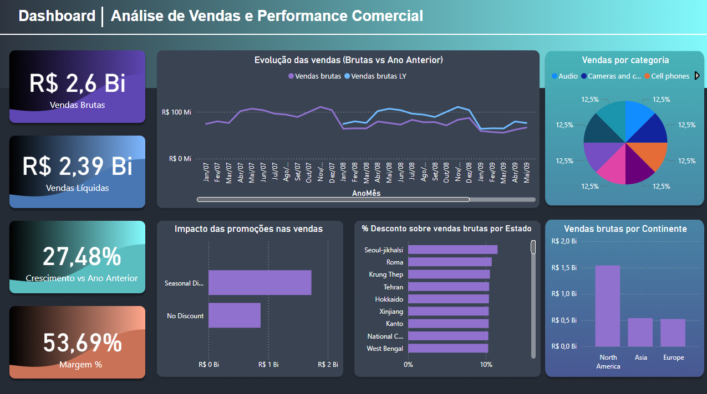
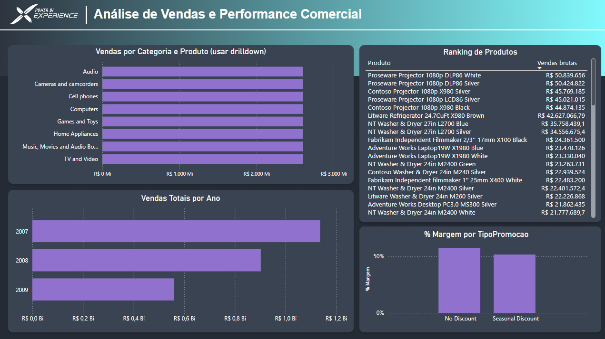

# Análise de Vendas e Performance Comercial 

Este projeto foi desenvolvido com foco na aplicação de Business Intelligence e Análise de Dados utilizando Power BI, com o objetivo de construir um modelo analítico completo para avaliação de desempenho comercial, impacto de promoções e comportamento de vendas ao longo do tempo.

O projeto simula um cenário real de análise corporativa, utilizando dados de vendas, produtos, promoções, lojas e calendário, aplicando boas práticas de modelagem em esquema estrela, criação de medidas em DAX, implementação de RLS e construção de dashboards analíticos.

O objetivo central é estruturar um **pipeline analítico completo**, desde a organização do modelo de dados até a construção de dashboards interativos.

---

## - Contexto Analítico

Em ambientes comerciais, a análise de vendas depende da correta organização dos dados e da definição de indicadores que permitam avaliar desempenho, rentabilidade e impacto de campanhas promocionais.

Este projeto foi desenvolvido para analisar:

- Evolução das vendas ao longo do tempo
- Impacto de promoções no faturamento
- Desempenho por produto e categoria
- Margem e desconto
- Ranking de produtos
- Distribuição geográfica das vendas

O foco foi aplicar técnicas comuns em projetos reais de BI, incluindo modelagem em estrela, criação de KPIs e segurança por usuário.

---

## - Objetivos

- Construir um modelo de dados consistente no Power BI
- Aplicar modelagem no padrão **Star Schema**
- Criar medidas em DAX para análise de desempenho
- Implementar **Row Level Security (RLS)**
- Desenvolver dashboards interativos
- Utilizar **drilldown, segmentações e KPIs**
- Simular um cenário real de análise comercial

---

## - Estrutura do Projeto

📁 data

┣ 📁 raw

┃ ┗ analise-vendas-performance-comercial_raw.pbix

📁 analysis

┣ decisoes_analiticas.md
┣ kpis_dax.md
┣ regras_de_negocio.md

📁 powerbi

┣ analise-vendas-performance-comercial.pbix

┣ 📁 assets

┃ ┗ img1.png
┃ ┗ img2.png

### Descrição das pastas

- **data/raw** → dados originais utilizados no projeto
- **analysis** → documentação conceitual das regras, KPIs e decisões analíticas
- **powerbi** → arquivo final do Power BI
- **assets** → imagens dos dashboards

---

## - Modelagem de Dados

O modelo foi estruturado seguindo o padrão **Esquema Estrela**, utilizando uma tabela fato de vendas conectada às dimensões.

Dimensões utilizadas:

- dCalendario
- dProdutos
- dCategoriaProdutos
- dSubCategoriaProdutos
- dPromocoes
- dLojas
- dLocalidades

Regras aplicadas:

- Direção de filtro D → F
- Remoção de relacionamentos ambíguos
- Criação de colunas DAX para relacionamento
- Uso de tabela calendário para inteligência de tempo

Também foi implementado:

- Row Level Security (RLS)
- Drilldown em gráficos
- Hierarquia de categoria → produto

---

## - Métricas e Indicadores

Principais KPIs criados:

- Vendas Brutas
- Vendas Líquidas
- Percentual de Desconto
- Margem (%)
- Vendas LY
- Crescimento vs LY
- Ranking de Produtos
- Impacto das Promoções

A lógica completa está documentada em:

📄 `analysis/kpis_dax.md`

---

## - Dashboards Desenvolvidos

### 1️- Visão Geral de Vendas

Dashboard com foco executivo, apresentando indicadores principais.

Principais análises:

- Evolução das vendas
- Comparação com ano anterior
- Vendas por categoria
- Impacto das promoções
- Distribuição por continente
- Percentual de desconto por estado

KPIs principais:

- Total de vendas
- Vendas líquidas
- Crescimento vs LY
- Percentual de desconto

---

### 2️- Análise de Produtos e Promoções

Dashboard voltado para análise detalhada.

Principais análises:

- Ranking de produtos
- Margem por tipo de promoção
- Vendas por categoria e produto (drilldown)
- Vendas por ano

---

## - Visualização dos Dashboards

### Visão Geral de Vendas

### Análise Detalhada

---

## - Considerações Finais

Este projeto demonstra a construção de uma solução completa de Business Intelligence utilizando Power BI, aplicando boas práticas de modelagem, criação de medidas em DAX, implementação de segurança e desenvolvimento de dashboards interativos.

O objetivo foi simular um cenário real de análise comercial, organizando os dados de forma consistente e criando visualizações que permitam interpretar o desempenho de vendas de forma clara.
